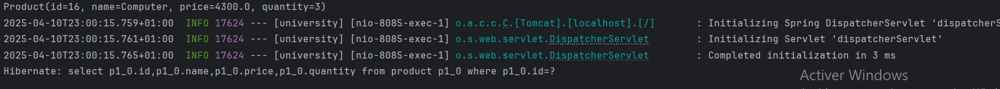

<h2>Compte rendu</h2>
<h3> Voici l'architecture de mon projet</h3>

<h3> Voici la classe Product </h3>

<h3> Voici l'interface ProductRepository </h3>

<h3> Voici la classe UniversityApplication </h3>

<h3> Voici application.propreties </h3>

<h3> Voici le pom.xml </h3>

<h3> Liste de produits en utilisant  h2 </h3>

<h3> Liste de produits sous format Jason </h3>

<h3> Liste de produits sous format Jason en specifiant l'idée du produit qu'on souhaite affiché (Dans ce cas id=2) </h3>

<h3> Sortie du projet  </h3>

